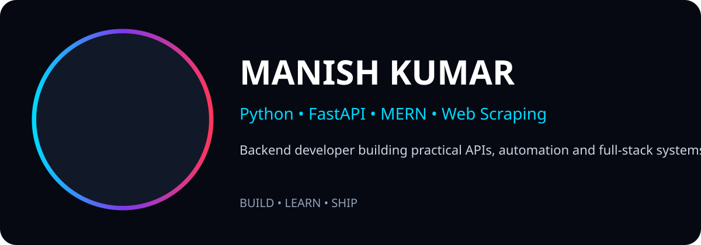
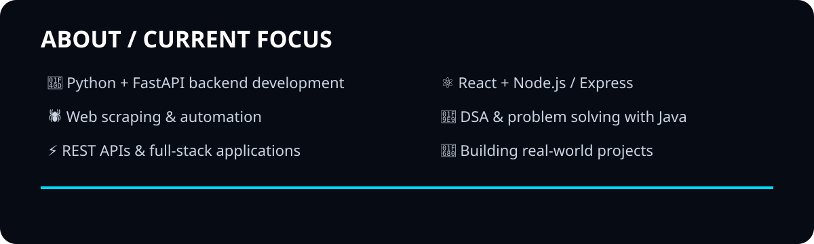
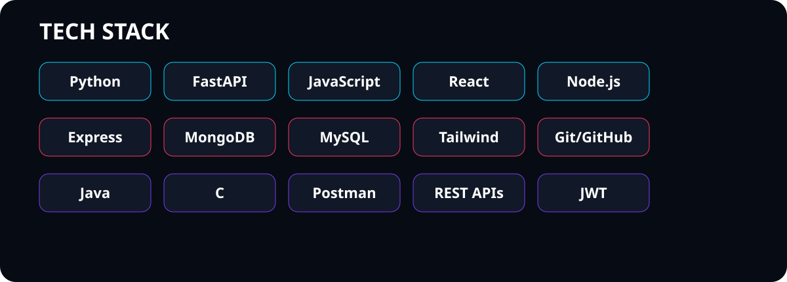
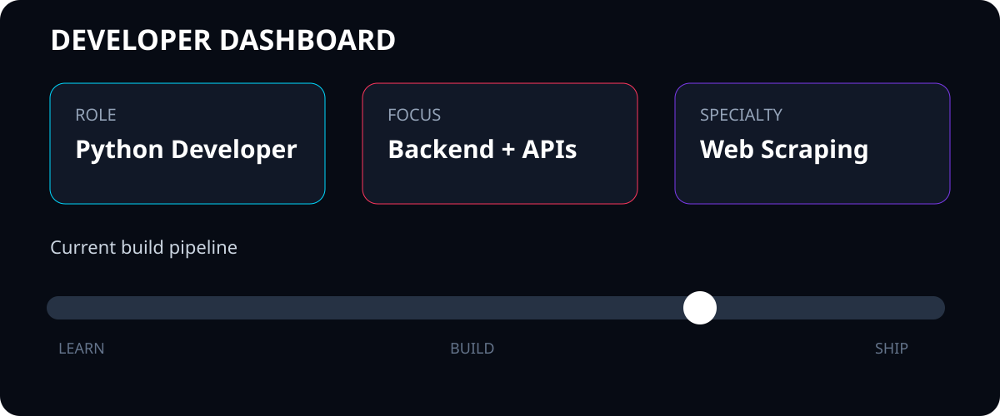
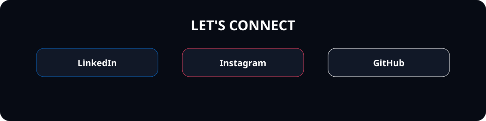

### Python Developer • Backend & APIs • Web Scraping • Full-Stack Development

  
  
  

## 👋 About Me

I'm Manish Kumar, a developer focused on turning ideas into practical, working software.

- 🐍 Python, FastAPI and backend development
- 🕷️ Web scraping and automation
- ⚡ REST APIs and full-stack applications
- ⚛️ React, Node.js and Express
- 🧩 DSA and problem solving with Java
- 🚀 Building and shipping real-world projects

## 🚀 Featured Projects

| Project | Description | Live |
|---|---|---|
| **AI Interview Agent** | AI-powered mock interviews with adaptive conversations, feedback, resume analysis and performance reports. | [Live Demo](https://ai-interview-agent-1-6819.onrender.com/) · [GitHub](https://github.com/manishkumar987174/AI_INTERVIEW_AGENT) |
| **LMS** | Full-stack Library Management System with Admin/Student roles, JWT authentication, issue/return flows, fines and reports. | [Live Demo](https://lms-manish.netlify.app/) · [GitHub](https://github.com/manishkumar987174/LMS) |
| **StyleHive** | E-commerce website focused on a clean shopping experience and responsive UI. | [Live Demo](https://stylehive.vercel.app/) · [GitHub](https://github.com/manishkumar987174/StyleHive) |

## 🛠️ Tech Stack

**Languages:** Python, JavaScript, Java, C  
**Frontend:** React, HTML5, CSS3, Tailwind CSS  
**Backend:** FastAPI, Node.js, Express.js, REST APIs  
**Database:** MongoDB, MySQL  
**Tools:** Git, GitHub, Postman  
**Security/API:** JWT

These technologies are based on the skills and stack listed in my existing GitHub profile README. 

## 📌 What I'm Working On

- Web scraping & automation
- Python backend development
- FastAPI & REST APIs
- Full-stack web applications
- DSA & problem solving
- Real-world software projects

## 📊 GitHub

  
  

  

**Building. Learning. Shipping. 🚀**

